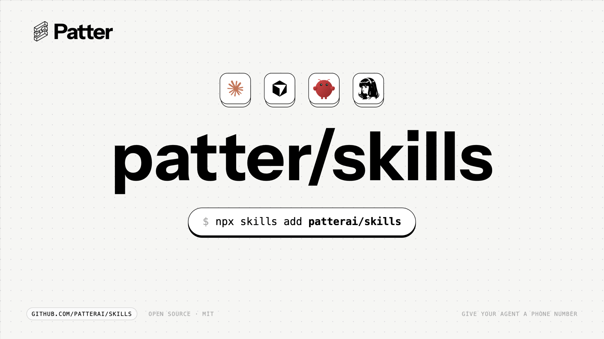

<p align="center">
  <picture>
    <source media="(prefers-color-scheme: dark)" srcset="./docs/github-banner.png" />
    <source media="(prefers-color-scheme: light)" srcset="./docs/github-banner.png" />
    
  </picture>
</p>

<h1 align="center">Patter Skills</h1>

<p align="center">
  <a href="https://www.skills.sh/patterai/skills"></a>
  <a href="https://github.com/PatterAI/Patter"></a>
  <a href="./LICENSE"></a>
</p>

<p align="center">
  <a href="#install">Install</a> •
  <a href="#skills">Skills</a> •
  <a href="#supported-agents">Supported agents</a> •
  <a href="https://github.com/PatterAI/Patter">SDK</a> •
  <a href="https://docs.getpatter.com">Docs</a>
</p>

---

[Agent Skills](https://agentskills.io) for the Patter SDK — give your AI agent a phone number in any harness that consumes the standard. One CLI, six skills, ~55 supported coding and voice agents.

## Install

```bash
# Install all skills
npx skills add patterai/skills

# Or install one
npx skills add patterai/skills --skill build-voice-agent

# Pin to a specific SDK version (recommended for production)
npx skills add patterai/skills#v0.7.0 --skill build-voice-agent
```

Skills land in `~/.agents/skills/<skill-name>/` (global) or `./.agents/skills/<skill-name>/` (project-local), with symlinks into each detected agent's skills directory.

## Skills

| Skill | What it teaches the agent |
|---|---|
| [`setup-patter`](./setup-patter) | Install Patter, walk the user through provider/carrier consoles, validate each API key, write `.env`. |
| [`build-voice-agent`](./build-voice-agent) | Build a voice agent — Realtime / ConvAI / Pipeline modes, with full Python and TypeScript examples. |
| [`configure-telephony`](./configure-telephony) | Twilio or Telnyx carrier setup — phone numbers, webhooks, tunnels, AMD, voicemail drop. |
| [`add-tools-and-handoffs`](./add-tools-and-handoffs) | Custom tools, `transfer_call`, `end_call`, output guardrails. |
| [`integrate-openclaw`](./integrate-openclaw) | Wire Patter as the voice layer on an OpenClaw brain — consult one scoped agent mid-call, survive long tool calls, open inbound, speakerphone tuning. |
| [`inspect-calls-and-metrics`](./inspect-calls-and-metrics) | Live dashboard, `CallMetrics`, cost tracking, CSV/JSON export. |

Larger skills (`build-voice-agent`, `configure-telephony`) bundle a `references/` directory the agent loads on demand for deep-dive topics. Tested against `getpatter` 0.7.0 in both Python (≥3.11) and TypeScript (Node ≥20).

## Supported agents

Skills work out-of-the-box in ~55 AI agent harnesses that consume the [Agent Skills](https://agentskills.io) standard:

**Coding agents** — Claude Code, Cursor, GitHub Copilot, Codex, Cline, Crush, Goose, Amp, Antigravity, Windsurf.

**Voice & autonomy harnesses** — Claude Desktop, OpenClaw, Hermes Agent, ChatGPT (MCP Apps).

The `skills` CLI auto-detects every agent on the user's machine and installs the symlinks in one shot.

## Requirements

- **Python 3.11+** or **Node.js 20+**
- `getpatter` package — `pip install "getpatter>=0.7.0"` or `npm install "getpatter@>=0.7.0"`
- Provider credentials in env: at least one of `OPENAI_API_KEY`, `ELEVENLABS_API_KEY`, `DEEPGRAM_API_KEY`, `CEREBRAS_API_KEY`, `ANTHROPIC_API_KEY`, `GOOGLE_API_KEY`, depending on the engine chosen
- Carrier credentials in env: Twilio (`TWILIO_ACCOUNT_SID` + `TWILIO_AUTH_TOKEN`) or Telnyx (`TELNYX_API_KEY` + `TELNYX_CONNECTION_ID`)

The `setup-patter` skill walks the user through every credential, one console at a time, with validation.

## Versioning

Skills version with the SDK. A skill at tag `v0.7.0` is guaranteed to match the API of `getpatter==0.7.0` (features marked *SDK main — post-0.7.0* ship in the next SDK release). Skills on `main` track the next unreleased version — pin to a tag for reproducibility.

## License

MIT — same as the [Patter SDK](https://github.com/PatterAI/Patter).

## Links

- **SDK source**: <https://github.com/PatterAI/Patter>
- **SDK docs**: <https://docs.getpatter.com>
- **skills.sh page**: <https://www.skills.sh/patterai/skills>
- **Agent Skills spec**: <https://agentskills.io/specification>
- **Skills CLI**: <https://github.com/vercel-labs/skills>
